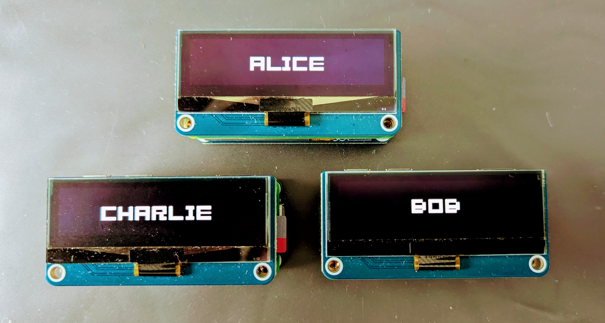
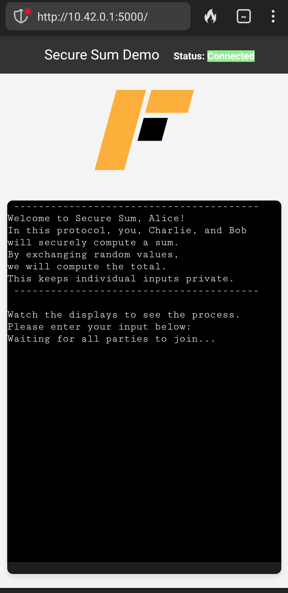

# Secure Multi-Party Computation Example on a Raspberry Pi

## Overview
This project was developed for the deRSE25 conference, a gathering of research software engineers, to showcase the [Federated Secure Computing architecture](https://github.com/federatedsecure) in a poster presentation. You can view the poster [here](deRSE.pdf). The project demonstrates a distributed, secure sum computation across three Raspberry Pi Zero 2WH. Each Raspberry Pi is equipped with a Waveshare UPS Hat C for power management and a Waveshare OLED 2.23-inch display for real-time output. The primary goal is to participate in a secure sum protocol as Alice, with communication facilitated via a smartphone running a simple web app within a network. The computations can be monitored on the Waveshare OLED displays of each Raspberry Pi. Behind the scenes, a custom protocol based on Federated Secure Computing architecture ensures secure communication.

<div style="text-align:center">
   
</div>

## Hardware Requirements

- **Raspberry Pi Zero 2 WH**: Three units for distributed computation.
- **Waveshare UPS Hat C**: Three units to provide uninterruptible power supply (UPS) and battery monitoring. (Note: The Raspberry Pis can also be powered via USB.)
- **Waveshare OLED 2.23-inch Display**: Three units for displaying computation results and system status.

## Software Requirements

- **Raspberry Pi OS Lite Bookworm**: Latest version with I2C and SPI enabled.

## Setup Instructions

### 1. Enable I2C and SPI on Raspberry Pi

- Use `raspi-config` to enable both I2C and SPI.

### 2. Install Required Libraries

- Load the software for *Alice*, *Bob*, and *Charlie* onto their respective Raspberry Pis and run the installation script. For example:
  ```bash
  cd alice
  ./install
   ```
### 3. **Setup Networking**:
To enable communication between the three Raspberry Pis, they must be on the same network. There are two options for achieving this:

#### Option 1: Connect All Pis to an Existing Network
- If your Raspberry Pis are connected to a shared network, ensure they are on the same local network.

#### Option 2: Set Up One Pi as a Hotspot
- To set up a private network without a host, configure one Raspberry Pi to act as a hotspot. The other Raspberry Pis can then connect to this hotspot.
- This can be done using NetworkManager. Create a connection profile for the hotspot by placing the following configuration in `/etc/NetworkManager/system-connections/fdrsc-hotspot.nmconnection`:

```
[connectio`]
id=fdrsc-hotspot
uuid=afc20a3d-f119-45dd-afbf-37b36f726a87
type=wifi
interface-name=wlan0
timestamp=1739190325

[wifi]
mode=ap
ssid=fdrsc-hotspot

[wifi-security]
key-mgmt=wpa-psk
psk=****PASSWORD****

[ipv4]
method=shared

[ipv6]
addr-gen-mode=default
method=auto

[proxy]
- After saving the file, run the following commands
```bash
sudo chmod 600 /etc/NetworkManager/system-connections/fdrsc-hotspot.nmconnection
sudo systemctl restart NetworkManager
sudo nmcli connection up fdrsc-hotspot
```
- Finally, connect the other Raspberry Pis to the hotspot. For example, use nmcli to connect:\
`sudo nmcli dev wifi connect fdrsc-hotspot -a`

- Check out the ip addresses of each Pi and set ip addresses in the file `/config/p2p.cfg` accordingly: 
```
[Alice]
addr = http://IP-ADRESS-ALICE:55501

[Bob]
addr = http://IP-ADRESS-BOB:55502

[Charlie]
addr = http://IP-ADRESS-CHARLIE:55503
```

### 4. **Start everythin up** 
Just ssh into *Alice* and run
```bash
cd alice
.\run.sh
```
With your phone you should be able to run the protocol as alice. Just got to http://IP-ALICE-ADRESS:5000 
<div style="text-align:center">
   
</div>

### Project Directory Structure for *Alice*, *Bob* or *Charlie*

The project directory structure is organized as follows:

#### `config/`
- **p2p.cfg**: Configuration file for peer-to-peer communication settings.

#### `scripts/`
- **run_alice.sh**: Shell script used to start the process for *Alice*, *Bob* or *Charlie* (the participant in the secure sum protocol).

#### `src/`
- **alice.py**: Script that implements the logic for *Alice*, *Bob* or *Charlie* in the secure sum protocol.
- **display/**: Used to handle the display logic, code for the Waveshare OLED display.
- **utils.py**: Utility functions used across the project.

#### `third_party/`
Customized third-party libraries or external dependencies.
- **federatedsecure/**: Customized based on the [Federated Secure Computing architecture](https://github.com/federatedsecure) 
- **xterm/**: Customized based on [pyxterm](https://github.com/cs01/pyxtermjs) and [Xterm.js](https://xtermjs.org/)
